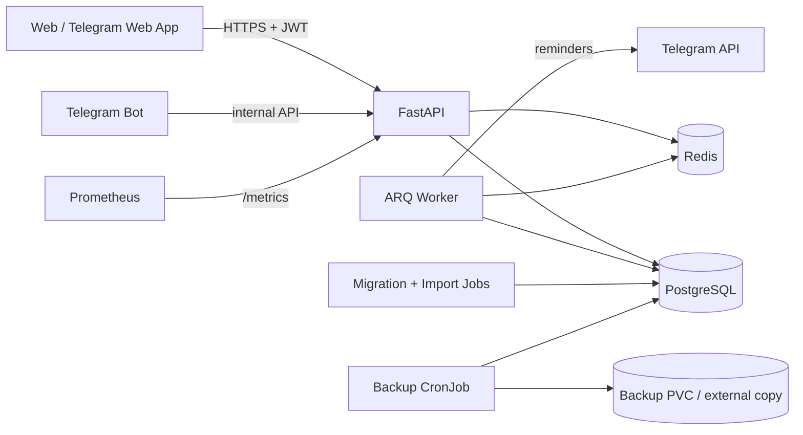

# Архитектура Ӟечбур

## Контуры системы

Один OCI-образ запускается в четырёх ролях: `api`, `bot`, `worker`, `migrate`/`import`. Это убирает рассинхронизацию версий модели и фоновых процессов. Web-клиент — статические файлы внутри API-образа; отдельный Node runtime в production не нужен.

## Предметная модель

- `DictionaryEntry` — нормализованная, но не обеднённая словарная статья.
- `User` — гостевой или связанный с Telegram профиль, серия и XP.
- `UserCard` — текущее состояние SRS для пары пользователь/слово.
- `ReviewLog` — неизменяемое событие ответа для аналитики и будущей калибровки.
- `GrammarProgress` — множество решённых упражнений и завершение урока.

Карточка не хранит перевод отдельно от статьи: `gloss` детерминированно извлекается при импорте, а полная `definition` остаётся источником истины. Повторный импорт идемпотентен по исходному `number`.

## Безопасность

- JWT подписывается HS256 и содержит `iss`, `aud`, `iat`, `exp`.
- Telegram Web App `initData` проверяется HMAC и принимается не старше одного часа.
- bot-to-API авторизация использует отдельный constant-time проверяемый секрет.
- контейнеры работают без root, без Linux capabilities и с read-only root filesystem в Kubernetes.
- секреты не попадают в ConfigMap или образ; Helm умеет использовать существующий Secret.
- внешние ответы словаря экранируются в браузере и в HTML-сообщениях Telegram.

Для публичного интернета стоит добавить ingress-level WAF/rate limiting, отдельный refresh-token поток для постоянных аккаунтов и удаление/экспорт данных пользователя.

## Масштабирование

API не хранит сессии в памяти и горизонтально масштабируется HPA. Bot в polling-режиме строго однорепличный (`Recreate`), чтобы Telegram update не обрабатывался дважды. Worker также однорепличный: ARQ допускает масштабирование, но один cron-планировщик исключает дубли напоминаний.

Поиск текущего релиза использует индекс по слову и ограниченную выборку. При росте нагрузки следует включить `pg_trgm`, GIN-индексы на `lower(word)`/`gloss` и курсорную пагинацию.

## Следующие качественные шаги

1. Полевое ревью грамматических уроков носителем или преподавателем удмуртского.
2. Частотный корпус вместо вручную заданного начального списка.
3. Аудио носителей для минимальных пар и диктантов.
4. A/B-калибровка SRS по retention, а не только по субъективной уверенности.
5. Управляемые PostgreSQL/Redis, object storage для бэкапов и OpenTelemetry traces.
